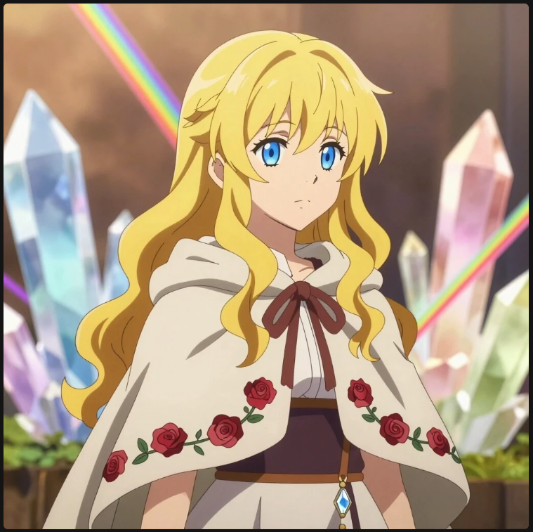
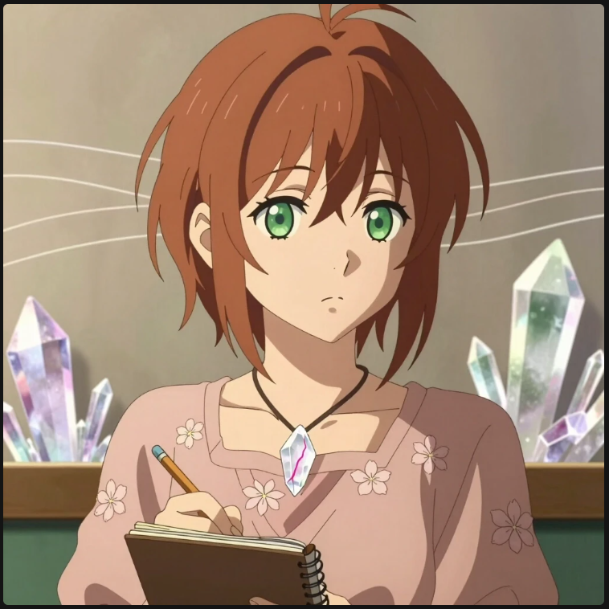
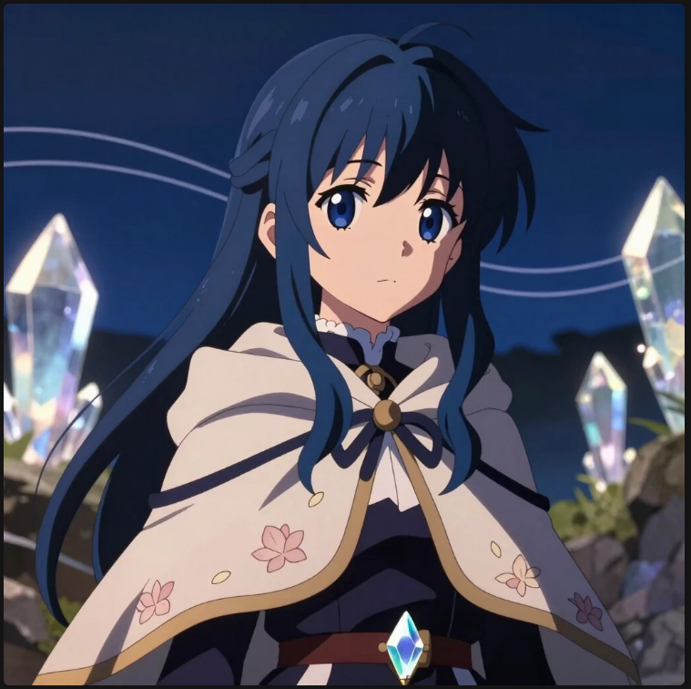
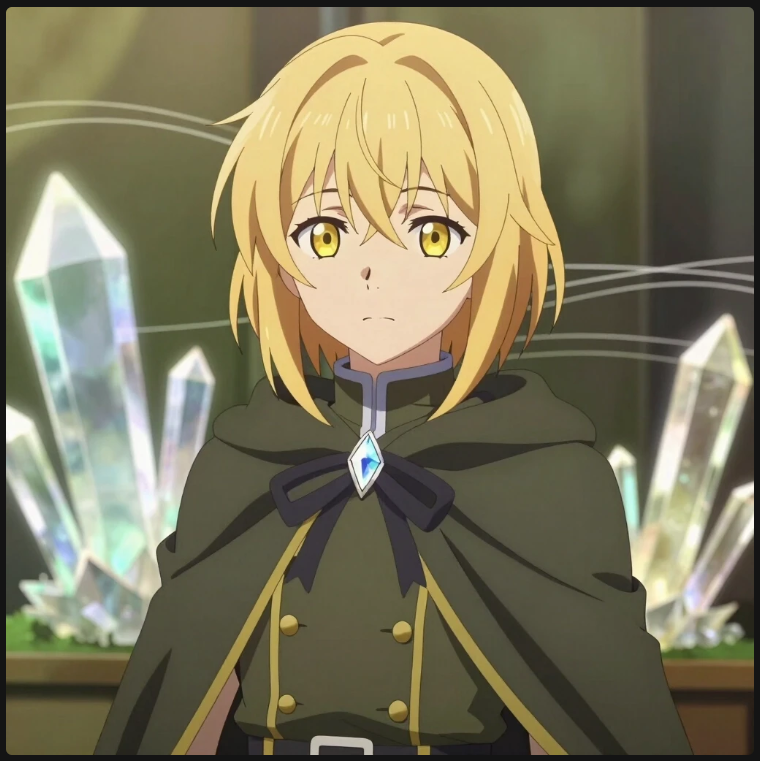
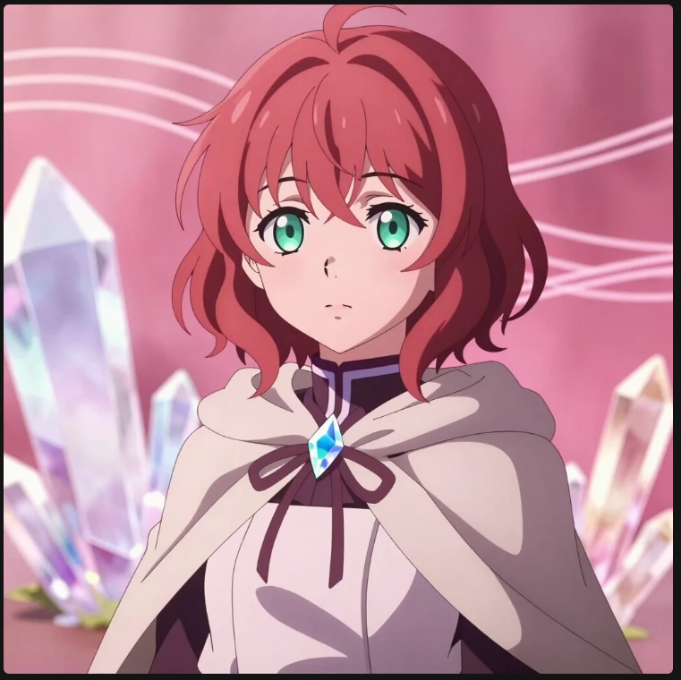
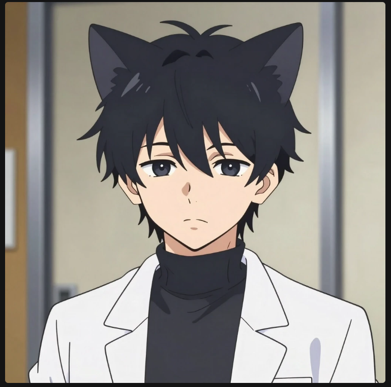

# Хроники Кватротрона

## Моё приключение: как мир пришёл ко мне в квартиру
Значит, так. Сижу я как то дома за компьютером — обыкновенно перебираю клавиши, дописываю последнюю главу про Кватротрон. Пальцы привычно бегут по кнопкам, будто сами знают, куда нажимать, а в голове всё ещё крутятся фразы, спотыкаются друг о друга, ищут правильный ритм. Я уже почти чувствую, как эта глава ложится на место, как последний кусочек мозаики, и от этого внутри и тепло, и немного тревожно — будто сейчас откроется дверь, которую я сам же и запер.
И вдруг прямо в комнате, где то на самой середине, вспыхивает свет. Не резкий, не слепящий, а такой, будто кто то щёлкнул невидимым выключателем на самой ткани мира. Бах! И свет тут же затухает, оставляя после себя странное ощущение — будто воздух ещё вибрирует от этого звука.
А потом появляется она — стена глубокой тёмной воды. Нет, она не течёт, не растекается по полу, не заливает ковёр и не собирается превращать мою комнату в озеро. Она стоит вертикально, ровно посередине, будто кто то поставил зеркало, но вместо отражения в нём — бесконечная глубина. И она вибрирует, как мембрана: по ней идут едва заметные круги, словно от невидимых капель, и каждый такой круг будто шепчет что то на незнакомом языке.
Если присмотреться, видно, что это не просто вода. Это тонкий слой тёмной воды, который ведёт куда то на другую сторону. И если бы я встал и подошёл к ней, если бы протянул руку и просунул её сквозь эту дрожащую поверхность, я бы не увидел свою руку с той стороны. Она просто исчезла бы, растворилась в этой странной границе между мирами.
Проходит минута, может, чуть больше. Время будто замедляется, прислушивается к тому, что сейчас произойдёт. И вот из этой стены выходит очень молоденькая девушка в школьной форме. Белый верх, рубашка, тёмный низ, очень коротенькая юбочка, из под которой виднеются две не очень длинных, но красивых ножки. Волосы слегка растрёпаны, будто она только что бежала по коридору, а большие зелёные глаза хлопают так невинно, что от этого взгляда становится и тепло, и страшно одновременно.
«Здравствуй, папа», — говорит она не голосом, а мыслями, и эта фраза врезается в сознание, как молния.
Стоп. Почему «папа»? Она по виду — юная школьница, совсем ребёнок, а я… я просто сижу за компьютером и пытаюсь закончить книгу.
«Папа!» — топнула она ножкой, будто я слишком долго думаю. «Ты меня не узнаёшь? Что, как неродной?»
И тут же за ней вываливается одна блондинка с волнистыми волосами.
«Здрасьте, я Зорика», — говорит она легко, будто это самое обычное дело — выходить из стены тёмной воды в чьей то комнате.
За ней тут же выскакивает, нет, буквально выпрыгивает ещё одна блондинка, на этот раз с короткой стрижкой.
«А я — Ятика!» — выкрикивает она, будто хочет перекрыть любой возможный протест.
А за ними тихо, почти несмело, заходит рыжая девушка.
«Я — Еленора», — произносит она тихо, будто боится нарушить хрупкое равновесие этой странной сцены.
Я сижу, пальцы застыли над клавиатурой, а перед глазами — эти девушки, которые пришли из моего же мира, из моей истории, будто решили, что бумажного существования им мало. И в этот момент я вдруг понимаю: они не просто персонажи. Они — живые, настоящие, и они пришли сюда не случайно.

---

## Утро после

А теперь утро. Тонкая золотистая полоска света ложится на пол, на стопки бумаг, на угол стола. На кровати мирно посапывают пять девочек — так устали после вчерашнего, что так и уснули прямо в школьной форме, будто даже во сне не хотели расставаться с тем, откуда пришли.

Лиэде лежит чуть боком, подложив ладонь под щёку. Зорика свернулась клубочком, будто пытается унести с собой тепло чужого мира. Эленора спит ровно, будто даже сейчас держит осанку ученицы Института. Ятика притулилась у стеночки — ищет самый тихий уголок. А маленькая Нира тихонько прижимается к Лиэде: рядом с ней всегда спокойнее.

Я стою в дверях и не шевелюсь, чтобы не спугнуть это утро. Пусть они поспят ещё немного. Пусть этот мир побудет просто уютным, без подвигов и великих решений.

И я записываю одну строчку — без зачёркиваний, ровно:  
*«Иногда самое важное в истории — это момент, когда все наконец-то могут просто отдохнуть».*

---

## Важное примечание
Дисклеймер: «Дочки-Цветочки» — персонажи-дочери богинь в авторской вселенной. Контент семейный, без взрослого подтекста.
«Это мои девочки из другого мира — мои дочки в смысле хранительниц, а не в каком-то другом. Пусть тут будет просто тепло и спокойно».

---

*Автор: Эдуард*  
*Вселенная в разработке. Черновики и дневниковые записи.*

## Что здесь есть

Это не законченная энциклопедия. Это живой архив: дневники, заметки, схемы, старые стихи — всё, что помогает держать мир на месте, пока он растёт.

- [Дневник Лиэде](diary-lieede.md) — её взгляд: спокойный, внимательный, будто она замечает даже то, что я сам упустил.
- [Дневник Ниры](diary-nira.md) — короткие, быстрые записи: вспышки чувств и внезапные озарения.
- [Лор: кристаллы и Кватротрон](lore-crystals.md) — механика мира: как растут кристаллы, как они связаны с троном, что такое кватронит.
- [Кошкатанский язык](cathtan-language.md) — как звучит речь кошкатов: интонации, ритмы, почему это больше похоже на песню, чем на обычную речь.
- [Песий-Град и его жители](pesiy-grad.md) — город, который будто разговаривает сам по себе, и те, кто в нём живёт.

<html>
<head>
    <title></title>
    ## Галерея персонажей
</head>
<body>
   

  <!-- Карточка Зорики -->
  

    
    

      <h3>Зорика</h3>
      
Из Дома Розы. Спокойная, наблюдательная, слышит кристаллы. Ведёт дневник, немного застенчива с незнакомцами, но с близкими раскрывается. Умеет стоять на своём, особенно в науке.

    

  

  <!-- Карточка  Лиэде -->
  

    
    

      <h3>Лиэде</h3>
      
Дочь Солнца, из Дома Лилий. Зелёные глаза, каштановые короткие волосы, слегка застенчивая, ленивая, любит поспать и мамины бутерброды с котлетой.

    

  

  
  <!-- Карточка  Ниры -->
  

    
    

      <h3>Нира</h3>
      
Младшая сестра Лиэду и ее учиница из дома лилий.

    

  

<!-- Карточка  Ятики -->
  

    
    

      <h3>Ятика</h3>
      
Девочка из Дома Катусов Ятика Характер: сложный, но уровнавешоный,родилась на Кватротроне в семье сттражий зашитнеков порядка.

    

  

 <!-- Карточка  эленора -->
  

    
    

      <h3>Эленора</h3>
      
Девочка из Дома Ромашки Эленора матер инженер Характер: спокойная, соредаточиная, говорит много, часто шутет но не умело.

    

  

 <!-- Маркиз -->
  

    
    <h4>Маркиз</h4>
    
Учёный археолог. Сдержанный, упрямый, рассеянный. Хранит этикет, но иногда забывает про официальный вид.

  

  
</body>
</html>

*Автор: Эдуард*  
*Вселенная в разработке. Черновики и дневниковые записи.*
