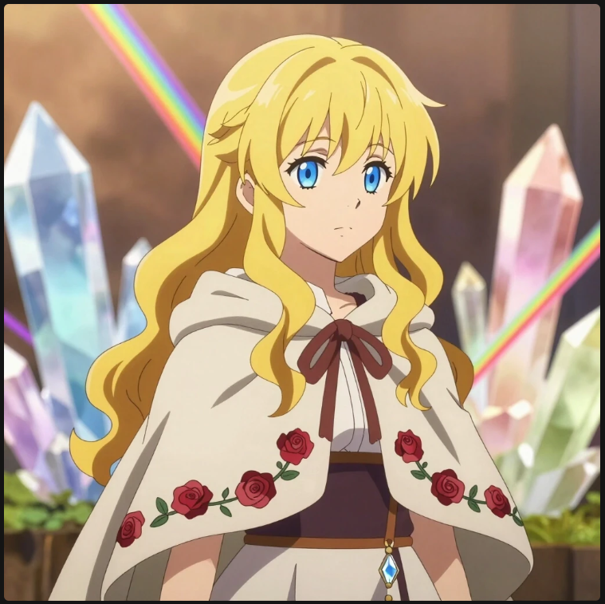
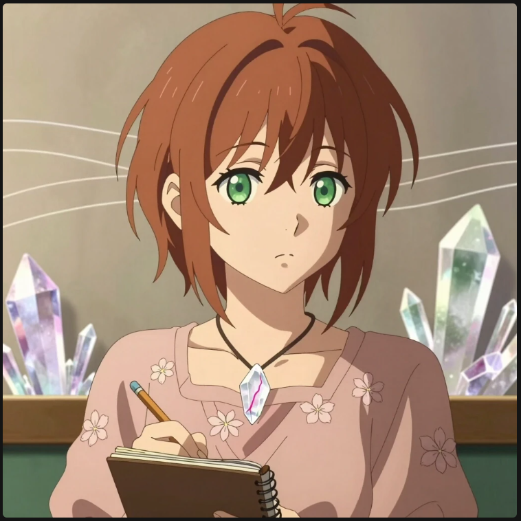
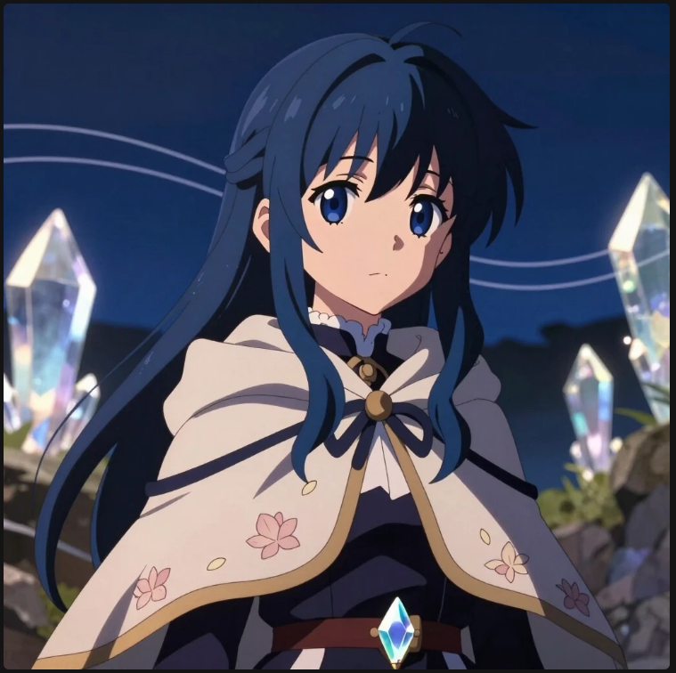
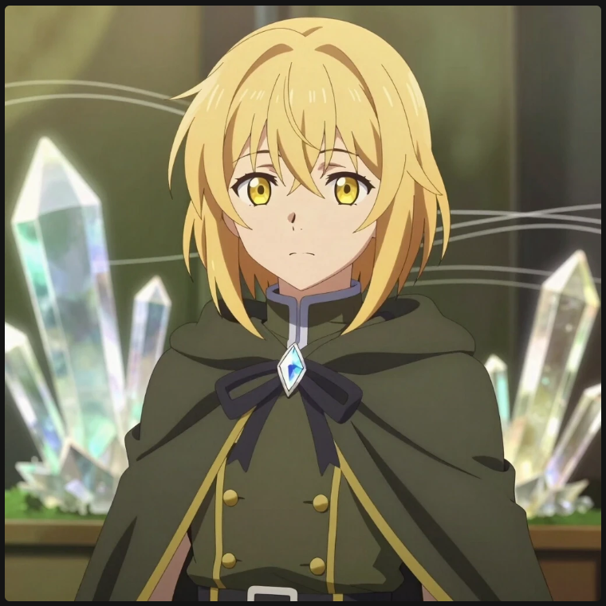
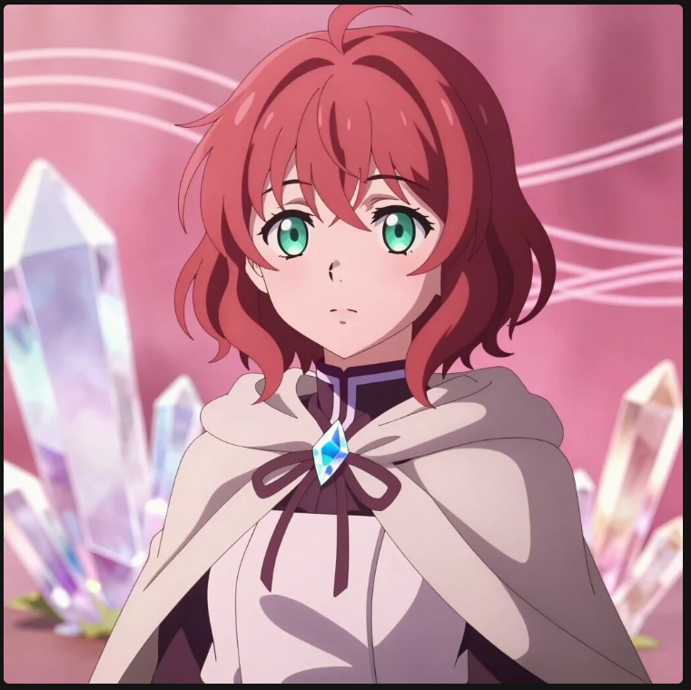

<html lang="ru">
<head>
    <meta charset="UTF-8">
    <title>Галерея персонажей — Кватротрон</title>
</head>
<body>

    <h1>Галерея персонажей</h1>

    

    

        <!-- Карточка Зорики -->
        

            
            

                <h3>Зорика</h3>
                
Из Дома Розы. Спокойная, наблюдательная, слышит кристаллы. Ведёт дневник, немного застенчива с незнакомцами, но с близкими раскрывается. Умеет стоять на своём, особенно в науке.

            

        

        <!-- Карточка Лиэде -->
        

            
            

                <h3>Лиэде</h3>
                
Дочь Солнца, из Дома Лилий. Зелёные глаза, каштановые короткие волосы, слегка застенчивая, ленивая, любит поспать и мамины бутерброды с котлетой.

            

        

        <!-- Карточка Ниры -->
        

            
            

                <h3>Нира</h3>
                
Младшая сестра Лиэде и её ученица из Дома Лилий.

            

        

        <!-- Карточка Ятики -->
        

            
            

                <h3>Ятика</h3>
                
Девочка из Дома Катусов. Родилась на Кватротроне в семье стражей защитников порядка. Характер сложный, но уравновешенный.

            

        

        <!-- Карточка Эленоры -->
        

            
            

                <h3>Эленора</h3>
                
Девочка из Дома Ромашки. Инженер. Спокойная, сосредоточенная, говорит много, часто шутит, но не всегда удачно.

            

        

        <!-- Карточка Маркиза -->
        

            
            

                <h3>Маркиз</h3>
                
Учёный-археолог. Сдержанный, упрямый, рассеянный. Хранит этикет, но иногда забывает про официальный вид.

            

        

    

</body>
</html>

